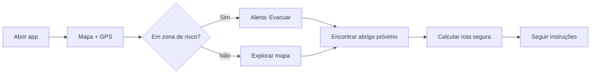

# Rota Segura — Categoria 2

> Ferramenta mobile-first para evacuação em cheias: mapa de zonas inundáveis, abrigos públicos e rotas seguras até ao centro de evacuação mais próximo.

---

## Visão do produto

Uma PWA em Português que permite a qualquer pessoa em Moçambique:

1. Ver no mapa **onde está em risco** (zonas inundáveis).
2. Encontrar o **abrigo / centro de evacuação** mais próximo com vagas disponíveis.
3. Seguir uma **rota segura** que evita áreas alagadas.
4. Partilhar a localização com familiares ou voluntários (bónus).

**Cidade piloto sugerida para a demo:** Beira ou Maputo (boa cobertura OpenStreetMap + dados reais de abrigos INGC).

---

## Casos de uso

### UC-01 — Ver mapa de risco na minha zona

| Campo | Descrição |
|---|---|
| **Ator** | Morador de bairro de risco |
| **Pré-condição** | App aberta no telemóvel; GPS activo (ou bairro seleccionado manualmente) |
| **Fluxo** | 1. Abre o mapa → 2. Vê a sua posição → 3. Zonas vermelhas/laranja mostram áreas inundáveis ou em alerta → 4. Toque numa zona mostra nível de risco e última actualização |
| **Pós-condição** | Utilizador compreende se está em zona de evacuação obrigatória |
| **Prioridade** | **Must have** |

---

### UC-02 — Encontrar abrigo público mais próximo

| Campo | Descrição |
|---|---|
| **Ator** | Família a evacuar |
| **Pré-condição** | Localização conhecida |
| **Fluxo** | 1. Toca «Encontrar abrigo» → 2. Lista/mapas dos 3 abrigos mais próximos → 3. Cada abrigo mostra: nome, distância, capacidade (ex.: 120/200 lugares), serviços (água, WC, medicamentos) → 4. Selecciona um abrigo |
| **Pós-condição** | Abrigo seleccionado como destino |
| **Prioridade** | **Must have** |

---

### UC-03 — Calcular rota segura de evacuação

| Campo | Descrição |
|---|---|
| **Ator** | Pessoa em evacuação |
| **Pré-condição** | Posição actual + abrigo destino seleccionado |
| **Fluxo** | 1. Toca «Rota segura» → 2. API de routing calcula percurso **evitando polígonos de inundação** → 3. Linha verde no mapa com distância e tempo estimado a pé → 4. Instruções passo-a-passo simplificadas («Vire à direita na Av. …») |
| **Pós-condição** | Rota visualizada; utilizador pode seguir no terreno |
| **Prioridade** | **Must have** |

---

### UC-04 — Ver capacidade dos abrigos em tempo real (bónus)

| Campo | Descrição |
|---|---|
| **Ator** | Coordenador INGC / voluntário no abrigo |
| **Pré-condição** | Conta de coordenador (PIN simples) |
| **Fluxo** | 1. Coordenador actualiza «lugares ocupados» com +/- → 2. Todos os utilizadores veem barra de capacidade actualizada em segundos |
| **Pós-condição** | Famílias redireccionadas para abrigos com vagas |
| **Prioridade** | **Should have** (bónus do hackathon) |

---

### UC-05 — Modo ligação lenta / offline parcial

| Campo | Descrição |
|---|---|
| **Ator** | Utilizador em rede 3G instável |
| **Pré-condição** | PWA instalada; tiles e dados de abrigos em cache |
| **Fluxo** | 1. Mapa base e abrigos carregam do cache → 2. Rotas calculadas quando há rede; se offline, mostra rota directa em linha recta + aviso «ligação fraca» → 3. Zonas de risco pré-descarregadas por município |
| **Pós-condição** | App utilizável mesmo com intermitência |
| **Prioridade** | **Must have** (requisito do hackathon) |

---

### UC-06 — Reportar estrada bloqueada (colaborativo)

| Campo | Descrição |
|---|---|
| **Ator** | Voluntário / morador |
| **Fluxo** | 1. Marca ponto no mapa como «intransitável» → 2. Próximos cálculos de rota evitam esse segmento |
| **Prioridade** | **Could have** (se sobrar tempo) |

---

## Stack recomendada

Escolhida para **construir rápido no hackathon**, funcionar em **3G** e cumprir **mobile-first**.

| Camada | Tecnologia | Porquê |
|---|---|---|
| **Frontend** | **Next.js 15** (App Router) + **TypeScript** | SSR leve, deploy fácil (Vercel), PWA |
| **UI** | **Tailwind CSS** + componentes simples | Rápido, responsivo, pouco peso |
| **Mapa** | **MapLibre GL JS** | Open-source, leve, suporta camadas vectoriais e offline melhor que Leaflet raster |
| **Tiles / base map** | **OpenStreetMap** via **MapTiler** (free tier) ou tiles OSM directos | Grátis, boa cobertura MZ; MapTiler optimiza para mobile |
| **Routing** | **OpenRouteService API** | Evita polígonos (zonas inundáveis), modo `foot-walking`, free tier para hackathon |
| **Backend / dados** | **Supabase** (Postgres + Realtime) | Abrigos, capacidade, zonas GeoJSON; auth simples para coordenadores |
| **Geodata** | **GeoJSON** no Supabase ou ficheiros estáticos | Polígonos de inundação + pontos de abrigos |
| **PWA** | `next-pwa` ou service worker manual | Cache de tiles e dados para 3G |
| **Deploy** | **Vercel** + Supabase cloud | Demo ao vivo em minutos |

### Alternativa mais simples (se o tempo apertar)

| Camada | Alternativa |
|---|---|
| Frontend | **Vite + React** (sem SSR) |
| Mapa | **Leaflet** + OSM tiles (curva de aprendizagem menor) |
| Routing | **OSRM** público (`router.project-osrm.org`) — sem avoid polygons nativo; simular com waypoints |

---

## API de mapas e routing — recomendação final

### Mapa base: **MapLibre GL JS** + **OpenStreetMap**

```
Utilizador → MapLibre (render) → Tiles OSM / MapTiler
                              → Camadas GeoJSON (zonas + abrigos + rotas)
```

- **Sem vendor lock-in** — importante para Moçambique (custo zero).
- **MapLibre** renderiza polígonos de inundação com cores sem recarregar a página inteira.
- Tiles vectoriais do MapTiler (~100k loads/mês grátis) são mais leves em 3G que imagens PNG grandes.

### Routing: **OpenRouteService (ORS)**

| Endpoint | Uso |
|---|---|
| `POST /v2/directions/foot-walking/geojson` | Rota a pé até ao abrigo |
| `POST /v2/isochrones/foot-walking` | «Abrigos a 15 min a pé» |
| `options.avoid_polygons` | **Evitar zonas inundáveis** (chave da demo) |

**Exemplo conceptual:**

```json
{
  "coordinates": [[35.529, -19.836], [35.540, -19.820]],
  "options": {
    "avoid_polygons": {
      "type": "MultiPolygon",
      "coordinates": [[[[35.53, -19.83], [35.54, -19.83], ...]]]
    }
  }
}
```

- Registo grátis em [openrouteservice.org](https://openrouteservice.org) → API key.
- Limite free: ~2000 pedidos/dia (suficiente para demo + testes).

### Porque NÃO Google Maps neste projecto

| Critério | Google Maps | OSM + ORS |
|---|---|---|
| Custo | Pago após créditos | Grátis |
| Peso em 3G | SDK pesado | MapLibre + vector tiles leves |
| Evitar zonas custom | Limitado / complexo | `avoid_polygons` nativo |
| Offline | Difícil | Cache de tiles + GeoJSON local |

---

## Camadas do mapa

```
┌─────────────────────────────────────────────┐
│  MAPA — Rota Segura                         │
├─────────────────────────────────────────────┤
│  🔴 Zonas inundáveis     (polígono vermelho) │
│  🟠 Zonas em alerta      (polígono laranja)  │
│  🟢 Abrigos com vagas    (marcador verde)    │
│  🟡 Abrigos quase cheios (marcador amarelo)  │
│  🔵 Posição do utilizador (ponto azul)       │
│  ━━ Rota segura          (linha verde)       │
│  ⛔ Estradas bloqueadas  (marcador cinza)    │
└─────────────────────────────────────────────┘
```

### Dados iniciais (seed para demo)

| Tipo | Fonte | Formato |
|---|---|---|
| Abrigos públicos | INGC, Cruz Vermelha, escolas designadas | GeoJSON `Point` |
| Zonas de risco | Dados históricos Beira/Maputo (Cyclone Idai, etc.) ou polígonos desenhados manualmente | GeoJSON `Polygon` |
| Capacidade | Inserida manualmente no Supabase para demo | `{ total: 200, ocupado: 85 }` |

---

## Fluxo principal (MVP demo)



---

## Âmbito MVP (ponta a ponta — 1 fluxo completo)

Para cumprir a orientação do hackathon (*uma funcionalidade que funciona de ponta a ponta*):

1. Mapa centrado numa cidade (Beira).
2. 5–8 abrigos públicos com capacidade fictícia mas realista.
3. 2–3 polígonos de zona inundável.
4. Botão **«Rota segura para o abrigo mais próximo»** que desenha rota evitando inundações.
5. Interface 100% em Português, optimizada para ecrã de telemóvel.
6. *(Bónus)* Coordenador actualiza capacidade → mapa reflecte em tempo real.

**Fora de âmbito no MVP:** integração real com operadoras (Vodacom/mCel), conta de utilizador completa, cobertura nacional.

**Integrado no MVP:** simuladores USSD/SMS + OpenRouteService para rotas reais a pé com `avoid_polygons`.

---

## OpenRouteService (ORS)

A chave fica em `.env.local` (nunca no repositório):

```
ORS_API_KEY=sua_chave
```

O endpoint `POST /api/rota` calcula a rota via ORS (`foot-walking`) evitando polígonos de inundação. Se a API falhar, usa fallback local.

---

## Estrutura de pastas sugerida

```
cursor_hackathon/
├── README.md
├── docs/
│   └── rota-segura.md          ← este documento
├── src/
│   ├── app/                    # Next.js pages
│   ├── components/
│   │   ├── Map.tsx             # MapLibre wrapper
│   │   ├── ShelterMarker.tsx
│   │   ├── FloodZoneLayer.tsx
│   │   └── RoutePanel.tsx
│   ├── lib/
│   │   ├── ors.ts              # OpenRouteService client
│   │   └── supabase.ts
│   └── data/
│       ├── abrigos-beira.json  # seed GeoJSON
│       └── zonas-risco.json
└── public/
    └── manifest.json           # PWA
```

---

## Próximos passos

1. [ ] Inicializar projecto Next.js + Tailwind + MapLibre
2. [ ] Criar conta OpenRouteService + MapTiler (API keys → `.env.local`)
3. [ ] Desenhar seed data: abrigos e zonas de Beira
4. [ ] Implementar mapa com 3 camadas (risco, abrigos, rota)
5. [ ] Integrar ORS com `avoid_polygons`
6. [ ] Supabase para capacidade em tempo real (bónus)
7. [ ] PWA + teste em throttling 3G (DevTools)
